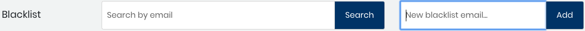

# Blacklist an Email Address

A blacklist lets you block an email address from being included in Dev Analytics data analyses. For example, in Profiles, you notice an email address that is for a Bot and has no affiliations. You might consider adding that email address to the blacklist so contributor counts are more accurate.

**Do these steps:**

1. Select a **project name** of interest.
2. Select **Identity Management**.
3. Select **Blacklist** from the menu . The Blacklist appears. 
4. \(Optional\) Enter an email address in the Search by email field and click **Search**. Email results list matches.
5. In the New blacklist email field, enter the **email address** that you want to add, and click **Add**. 
6. Click **Ok** on the Success confirmation dialog that appears. The Email blacklist shows the added email address.

### Delete an Email Address From the Blacklist

You can delete an email address from the Blacklist. This action means that Dev Analytics will include the email address in relevant analytics.

**Do these steps:**

1. Select a **project name** of interest.
2. Select **Identity Management**.
3. Select **Blacklist** from the menu . The Blacklist appears.
4. Click **Delete** on the row of the email address that you want to delete from the blacklist.
5. Click **Delete** on the Confirm dialog that appears.
6. Click **Ok** on the Success confirmation dialog that appears. The email address is removed from the Blacklist.

