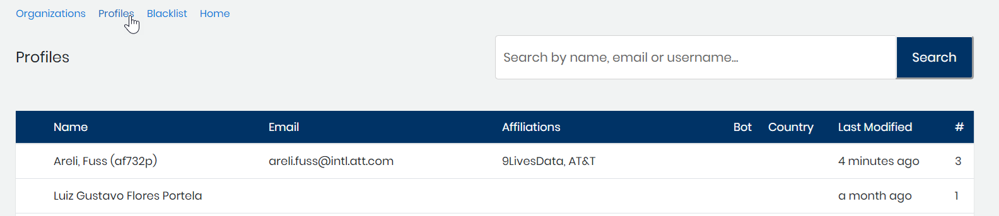

# Edit Profile Personal Details

Edit a profile to add or update contributor information. For example, you want a proper noun to appear in names in dashboards and not a contributor username. You can edit the Name field to the proper nouns, for example: `John Smith` rather than `j_smith`. In another example, you want to mark a profile as a bot to indicate that the activity may not be worth counting. When you [add a dashboard filter](../view-dashboard-analytics/add-and-manage-data-filters.md) to exclude bots, the contributions for this profile are not counted in dashboards.

**Do these steps:**

1. Select a **project name** of interest.
2. Select **Identity Management**.
3. Select **Profiles** from the menu or [find the identity that you want](find-a-profile-or-organization.md).

  4. Click a **row** that corresponds to a name of interest.  
        Profile Information appears.  
  5. Personal Details show Name, E-mail, Bot, and Country.   
  6. Click **Edit**.  

_\*\*_The Name, E-mail, and Bot fields become editable.

 7. Update any of the Personal Details and click **Save Changes**.

This is the end!!!\(Test content\)

