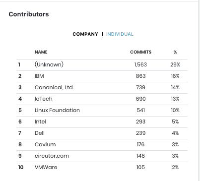
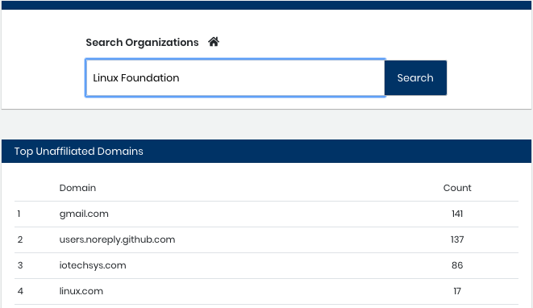
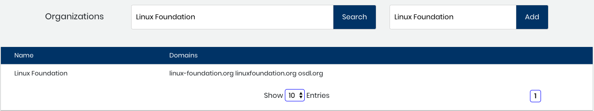
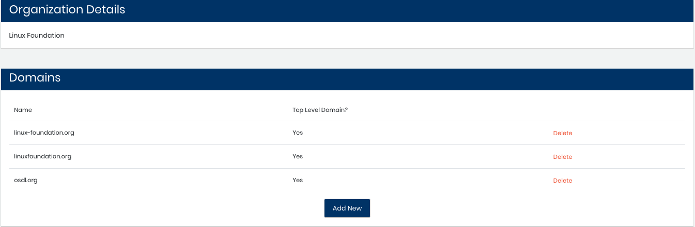
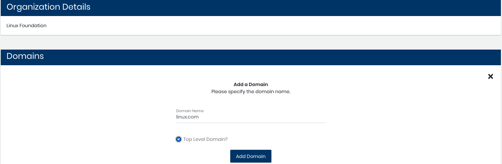
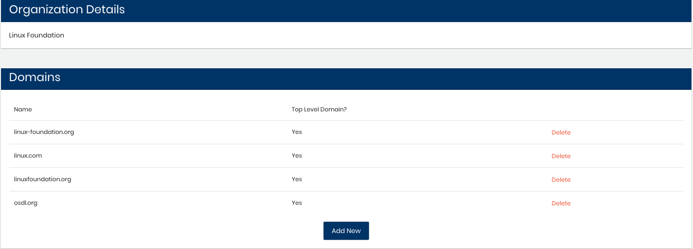

# Example: Address Unaffiliated Domains

This example demonstrates how to address contributions to organizations that have unaffiliated domains to help ensure accurate statistics for your project.

As a community manager at the Linux Foundation, you want to make sure that contributions to the foundation are counted in charts such as in Contributors \| COMPANY.  
  

A developer might contribute to a Linux Foundation project under a profile that does not have a domain affiliation. These contributions can cause inaccurate counts for your organizations. Your job is to find these unaffiliated domains and affiliate them with the correct Linux Foundation organization.

**Do these steps:**

1. Select **Home**.
2. View the Top Unaffiliated Domains list and look for a Linux Foundation domain name. You notice that `linux.com` is an unaffiliated domain. Because of your experience as the community manager, you know that `linux.com` is a top-level domain that belongs to the Linux Foundation organization. Enter **Linux Foundation** in Search Organizations and click **Search**.    Results show the Linux Foundation organization:    
3. Click **Add**. Results show the domains that are affiliated with the Linux Foundation organization. You see that `linux.com` is not listed.    
4. Click **Add New**. The Add a Domain pane appears.
5. Enter the domain name and specify that the domain is a Top Level Domain. Click **Add Domain**.    The domain is affiliated with the Linux Foundation organization:    
6. Select **Home**.  
   The `linux.com` count is reduced in Top Unaffiliated Domains.

   Important!

   Due to a lag in the list refresh, names can remain in a Top Unaffiliated list even after you have addressed the missing affiliation. Check the list again later.

