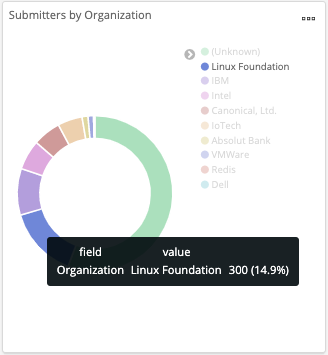
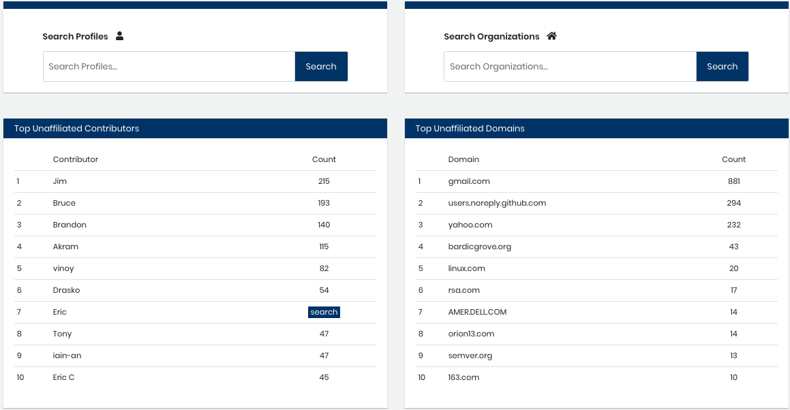
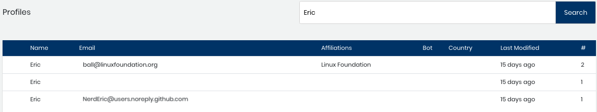
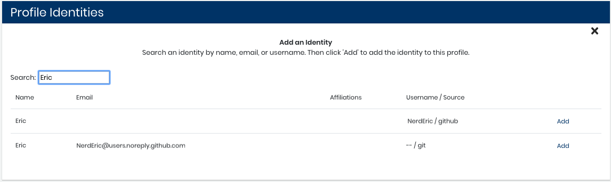
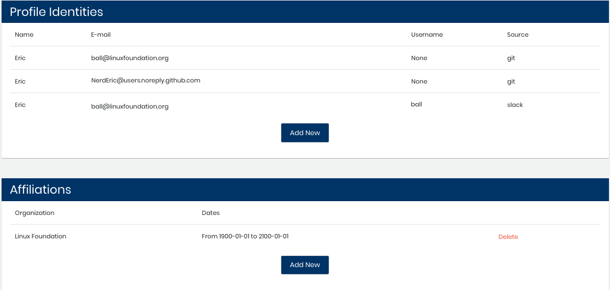

# Example: Address Unaffiliated Identities

This example demonstrates how to address contributions by unaffiliated identities to help ensure accurate statistics for your project.

As a community manager at the Linux Foundation, you want to make sure that the contributions for the foundation are counted in charts such as in the Submitters by Organization doughnut chart for GitHub:  
  

Some developers \(profiles\) might contribute to GitHub under email addresses that are not affiliated with the foundation, such as a `gmail.com` email address and not a `linuxfoundation.org` address. These contributions by unaffiliated identities cause inaccurate counts. Your job is to find these unaffiliated identities and affiliate them with the correct Linux Foundation contributor profile.

**Do these steps:**

1. Select **Home**.
2. View the Top Unaffiliated Contributors list and look for a Linux Foundation contributor name. You notice that Eric has unaffiliated contributions. Click **search** on his row.    Profiles shows email addresses and affiliations that Eric uses. You see that Eric is affiliated with the Linux Foundation. You notice that Eric has an unaffiliated email address: `NerdEric@user.noreply.github.com`. Dev Analytics could not automatically match the email to the Linux Foundation.    
3. Use various methods \(your community knowledge, contact Eric, check-in GitHub, and so on\) to validate that `NerdEric@user.noreply.github.com` should be affiliated with Eric and the Linux Foundation.
4. Select the `ball@linuxfoundation.org` row. Eric's profile opens.
5. In the Profile Identities section, click **Add New**.
6. Search for Eric. The results show `NerdEric@user.noreply.github.com`. Click **Add**.    `NerdEric@user.noreply.github.com` is added as an identity to Eric's profile:    
7. Select **Home**.  
   Eric is not listed in the Top Unaffiliated Contributors list.

   Important!

   Due to a lag in the list refresh, names can remain in a Top Unaffiliated list even after you have addressed the missing affiliation. Check the list again later.

