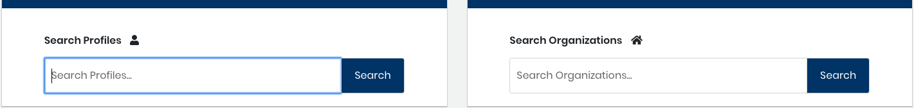

# Find a Profile or Organization

You can search by a name or keyword to find specific profiles or organizations. The search results let you identify what data \(for example, Email or Affiliations\) is not provided in a profile, and that you might want to add.

**Do these steps:**

1. Select a **project name** of interest.
2. Select **Identity Management**. The Identity Management Home page shows Search Profiles and Search Organizations fields.  
3. In a Search field, enter a **name** or **keyword** and click **Search**.
   * Profile results show Name, Email, Affiliations, Bot, Country, Last Modified, and \#. The following column headers require explanation:
     * Affiliations shows the name of the organization that is affiliated with the profile.
     * Number \(\#\) shows the number of identities that are affiliated with the profile.
   * Organization results show Name and Domains.
4. \(Optional\) Continue to [Add an Identity to a Profile](add-an-identity-to-a-profile.md), [Add or Delete a Profile Organization Affiliation](add-or-delete-a-profile-organization-affiliation.md), or both.

