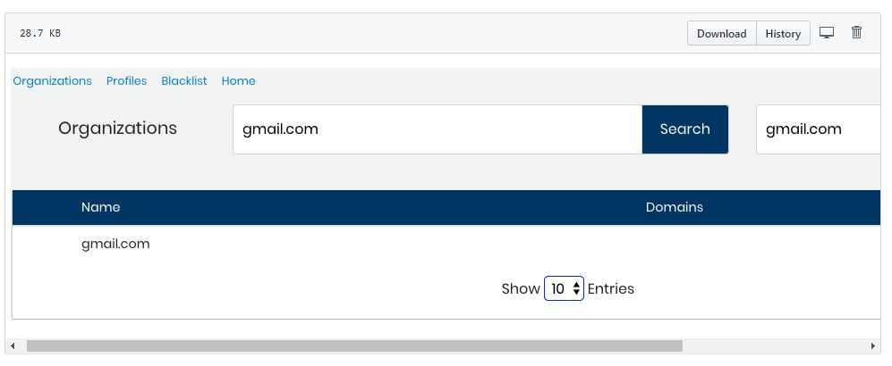

# View and Address the Top Unaffiliated Contributors and Domains testing

This is ---- Top Unaffiliated Contributors and Top Unaffiliated Domains list the top-ten respective items with the greatest numbers of contributions that have no affiliation. Addressing missing affiliations produces meaningful statistics about your contributors and domains because individual contributions are not underestimated. Different roles \(examples: organization representatives, individual contributors, or community managers\) might recognize that contribution counts seem underestimated or inaccurate. These roles can take action by addressing missing affiliations.

this is for testing purpose!!

**Do these steps:**

1. Select a **project name** of interest.
2. Select **Identity Management**. Identity Management shows:
   * Top Unaffiliated Contributors—profiles with the greatest numbers of contributions that have no affiliation.
   * Top Unaffiliated Domains—domains with the greatest numbers of contributions that have no affiliation.

## Address Top Unaffiliated Contributors

in Top Unaffiliated Contributors, look for a contributor who belongs to your project community. Missing affiliations for this contributor's profile might cause inaccurate counts for your project statistics.

**Do these steps:**

1. In Top Unaffiliated Contributor, mouse over the Count **number** for the contributor of interest and click **search**. The profile identities are listed. Each identity shows Name, Email, Affiliations, Bot, Country, Last Modified, and \#.
2. Look for a name that does not have an affiliation \(Affiliations is blank\) and click the **name**. Profile information for the name appears.
3. Continue to Step 5 in [Add an Identity to a Profile](add-an-identity-to-a-profile.md).
4. Select **Home** and scan Top Unaffiliated Contributors. The contributor name is no longer listed because you have addressed the missing affiliations.

**See:**  
[Example: Address Unaffiliated Identities](example-address-unaffiliated-identities.md)

## Address Top Unaffiliated Domains

in Top Unaffiliated Domains, look for a domain that belongs to your project. Missing affiliations for this domain might cause inaccurate counts for your project statistics.

**Do these steps:**

1. In Search Organizations, enter the name that matches a Top Unaffiliated Domain of interest and click **search**. Matching domains are listed. When no matching domains are listed, a name that matches the organization name you searched for appears in the Add field:

    ![][1]
   
    [1]: ../.gitbook/assets/7409314.png

2. Click **Add** to add the name as a domain affiliated to the organization.
3. Continue to Add an Organization Affiliation in [Add or Delete a Profile Organization Affiliation](add-or-delete-a-profile-organization-affiliation.md).
4. Select **Home** and scan Top Unaffiliated Domains. The domain name is no longer listed because you have addressed the missing affiliations.

**See:**  
[Example: Address Unaffiliated Domains](example-address-unaffiliated-domains.md)


Due to a lag in the list refresh, names can remain in a Top Unaffiliated list even after you have addressed the missing affiliation. Check the list again later.


