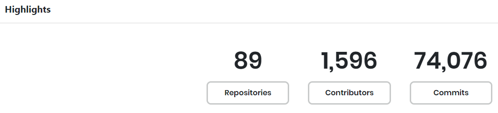
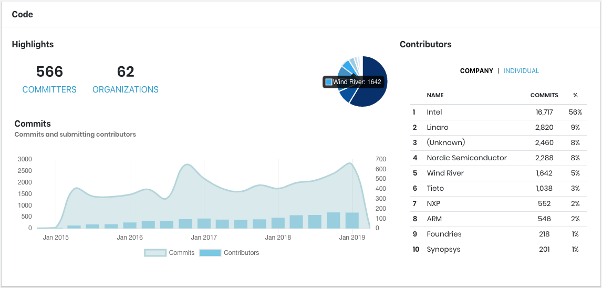
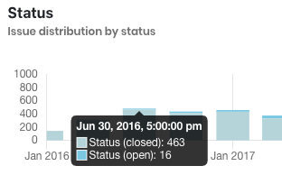
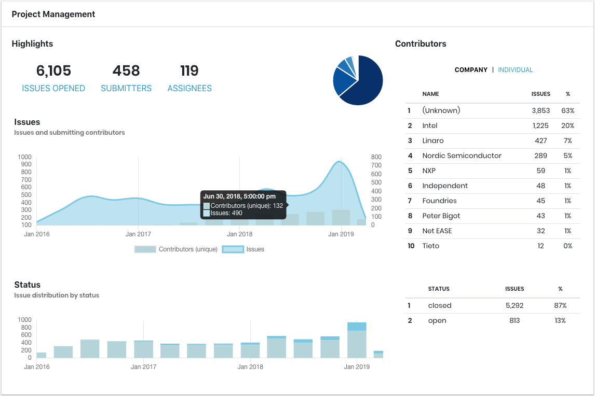
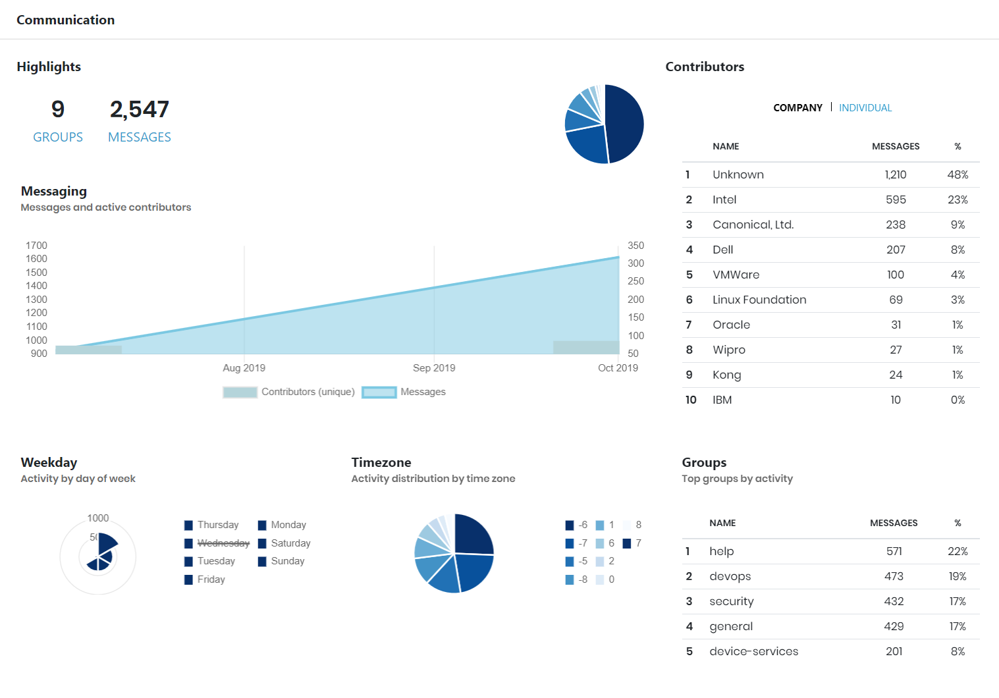

# General

Where

The General dashboard is available from the **Code** drop-down list.

### General &gt; Overview

SUMMARY: Overview provides high-level metrics about each data source for which the project is configured.

**Highlights** shows the total numbers of repositories, contributors, and commits for the project.

  
View an example of Highlights section

**Code** shows overview analytics about project commits and contributors:

* **Highlights** shows the number of committers and organizations in the project. 
* **Contributors** lists the top-ten contributors to the project by name, number of commits, and percentage of the total number of commits. Click **COMPANY** or **INDIVIDUAL** to show the corresponding commit data. A pie chart shows proportional data for the total number of commits per company or individual as a slice of the pie. The pie chart data corresponds to your Contributors selection: COMPANY or INDIVIDUAL. Mouse over a slice to show the number of commits and the company or individual name.
* **Commits** shows a stacked area chart that compares the number of code or issue commits per calendar period. The number of the commits submitted and the contributors who submitted to the project during each period are color-coded. Click **Commits** or **Contributors** to eliminate the corresponding data, for example: . Click the caption again to include the data.

  
View an example of Code overview section

**Project Management** shows overview analytics about issues, their statuses, and contributors:

* **Highlights** shows the number of issues opened, submitters, and assignees in the project.
* **Contributors** lists the top-ten contributors to the project by name, number of issues submitted, and percentage of the total number of issues. Click **COMPANY** or **INDIVIDUAL** to show the corresponding issue data. A pie chart shows proportional data for the total number of issues per company or individual as a slice of the pie. The pie chart data corresponds to your Contributors selection: COMPANY or INDIVIDUAL. Mouse over a slice to show the number of issues and the company or individual name.
* **Issues** shows a stacked area chart that compares the number of issues and unique contributors per calendar period. The number of issues and unique contributors for the project during each period are color-coded. Click **Contributors \(unique\)** or **Issues** to eliminate the corresponding data, for example: . Click the caption again to include the data.
* **Status** shows a stacked bar graph that compares the number of open and closed issues per calendar period. A corresponding table summarizes issues by closed or by open status and shows the total number of issues and the percentage of the total issues for each status. The issue statuses are color-coded. Mouse over a bar in the Status stacked bar graph to show the date, time, and number of open and closed issues.

  
View an example of Project Management overview section

**Communication** shows overview analytics about messaging communication such as in Slack or email that occurred in the project:

* **Highlights** shows the number of groups and messages in the project. 
* **Contributors** lists the top-ten contributors to the project by name, number of messages, and percentage of the total number of messages. Click **COMPANY** or **INDIVIDUAL** to show the corresponding message data. A pie chart shows proportional data for the total number of messages per company or individual as a slice of the pie. The pie chart data corresponds to your Contributors selection: COMPANY or INDIVIDUAL. Mouse over a slice to show the number of messages and the company or individual name.
* **Messaging** shows a stacked area graph that compares the number of messages and unique contributors per calendar period. The number of messages and unique contributors for the project during each period are color-coded. Click **Contributors \(unique\)** or **Messages** to eliminate the corresponding data, for example: . Click the caption again to include the data.
* **Weekday** shows a multi-level pie chart that represents the number of messages per day of the week. Mouse over a color in the chart to see the total number of messages per day. A corresponding legend identifies the color values. Click a **weekday** to eliminate the corresponding data, for example: . Click the caption again to include the data.
* **Timezone** shows a pie chart that represents the distribution of messages per Coordinated Universal Time \(UTC\) time zone. Mouse over a color in the chart to see the total number of messages for each time zone. A corresponding legend identifies the color values. Click a **time zone** to eliminate the corresponding data, for example: . Click the caption again to include the data.
* **Groups** lists the top groups measured by the number of message activities. The list includes the group name, number of messages, and the percentage of the total messages for the project. 

  
View an example of Communication overview section

